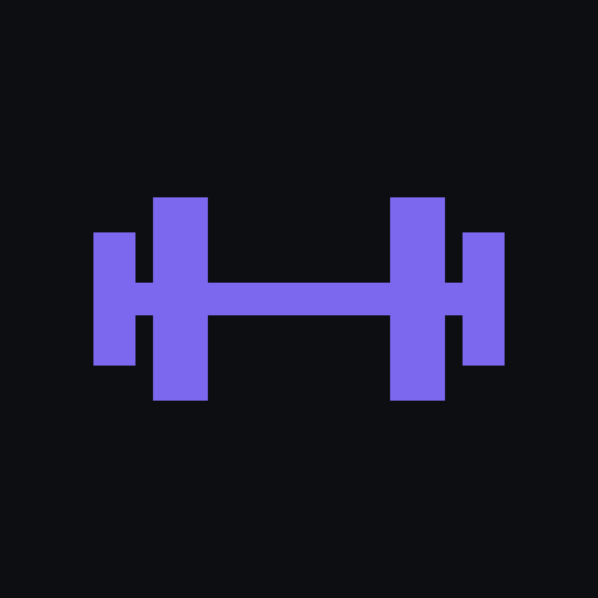

<div align="center">



<h1>quietGym</h1>

<br>

**A self-hosted gym & body-weight tracker you actually own.**

Plan your week, run guided workouts, track every set and your body weight over time —
on your phone, synced across devices, behind your own password.
No account on someone else's server, no subscription, no ads.

<br>

[](LICENSE)


<br>

[](https://github.com/btQuiet/quietGym/stargazers)
[](https://github.com/btQuiet/quietGym/issues)

</div>

<br>

<div align="center">
<table>
<tr>
<td align="center"><br><sub><b>Home</b> — today's workout & weight</sub></td>
<td align="center"><br><sub><b>Guided workout</b> — animated demos & sets</sub></td>
<td align="center"><br><sub><b>Stats</b> — heatmap, charts & PRs</sub></td>
</tr>
</table>
</div>

<div align="center">

### [🌐 opengym.duarte-santos.ch](https://opengym.duarte-santos.ch) · [▶ Try the live demo](https://duartesantos8.github.io/openGym/)

No signup, nothing to install — it runs entirely in your browser on example data.<br>
<sub>There's no server behind the demo, so password sign-in and sync across devices only
exist in a self-hosted instance.</sub>

</div>

## Why

Most workout apps lock your data behind a login on their servers, nag you to upgrade, or
disappear when the startup does. quietGym is the opposite: **it runs on your box, your data
stays in a folder you control, and it's yours to fork.** It still feels modern — installable
as a home-screen app, password sign-in, offline support, sync across your phone and laptop.

## Features

- ⚖️ **Body-weight tracking** — interactive chart with a goal line you set, gains/losses colored by whether they move toward it
- 🏋️ **Weekly plan** — a routine per weekday, over a library of **1,324 exercises** (searchable, with animated demos)
- 🗓️ **Reschedule any day** — sick, missed a session, or fewer gym days this week? Move a workout to another day without touching your weekly plan
- ▶️ **Guided workouts** — it knows what day it is and starts today's session; asks your body weight first, pre-fills your weights from last time, rest timer, PR detection, per-exercise weight tracking
- ☀️ **The screen stays awake while you train** — no unlocking the phone and finding your place again between every set. On for as long as a workout is running, released the moment you finish it, and switchable off in Settings
- 🔗 **Supersets** — build them, and log them back-to-back with a rest only after the pair
- ⏱️ **Timed exercises** — planks, hangs, wall sits and loaded carries are logged by time, not reps, with a work timer that counts the set itself (separate from the rest timer) and logs the time you actually held. They can carry weight too
- 📈 **Progression that follows a rule** — pick one per routine, override it per exercise: linear, **Greyskull LP** (AMRAP top set, double jumps, 10 % resets), double progression through a rep range, or adding time. Your weights are already right when the session opens, and every target says *why* it's that number. Missed reps never advance the load, stalls trigger a deload, and bodyweight exercises progress in reps instead
- 💪 **Estimated 1RM** — per exercise, from your best eligible set (it names which one), with its own progress curve and a calculator for sets you haven't done. Won't guess above 12 reps
- 🎯 **Effort per set, in your scale** — an optional third column rating how hard a set was, as **RIR** (reps left in the tank) or **RPE** (the same judgement on a 10-point scale). Off by default; each set keeps the scale it was logged with, and nothing else reads the value — your progression and 1RM are unaffected
- 💪 **Bodyweight exercises, logged as bodyweight** — push-ups, pull-ups, dips and 300-odd others arrive knowing they carry no load, so there's no weight column and no working-weight prompt: one stepper, log the reps. Add a dip belt and it reads as an addition, and progression goes back to following the weight. Without one, reps climb — and past a ceiling you set, a set is added instead of a rep, up to the point where the honest advice is load or a harder variation
- ↔️ **Reps per side** — for lunges, single-arm rows and the rest. You log the total, the app shows the split ("8 per side"), and the target steps in twos so it never lands on a number one side can't have
- 🏃 **Cardio** — log time + speed, not just weight × reps
- 📤 **Share a plan** — send someone your routines and week schedule as a small file (no workouts, no weigh-ins), or print it as a clean PDF. Importing merges, so their plan is never overwritten
- 🔧 **Filter by equipment** — narrow the library to what you actually own; the options adapt to what you've picked, so every combination on screen has results behind it
- ✨ **Your own exercises** — a name and a body part is enough; they behave like built-in ones everywhere, with an optional description instead of an animation
- 🟩 **Activity heatmap** — a GitHub-style year view, shaded by time spent training
- 💪 **Muscle map** — a front-and-back body diagram shaded by how much work each muscle got, over a week, a month or all time. It names the muscles you *haven't* trained in that period, previews what a routine hits while you build it, and shows what you just trained when you finish. Male or female figure, your pick
- 🔔 **Push notifications** — rest-timer alerts even with the app closed, plus an optional reminder on days you have a workout planned but haven't logged one. Opt in once; keys are generated on first run, nothing to configure
- 🔑 **One private owner** — a single password-protected account, with the password hashed using Argon2id and data synced across devices
- 🎨 **Designed, not assembled** — light/dark themes, 8 accent colors and the quietStorage theme saved to your account, over a hand-drawn icon set instead of emoji, so it looks the same on every phone
- 🌍 **12 languages** — full UI translation (EN, DE, ES, FR, IT, PT, PL, TR, RU, ZH, KO, HI); exercise instructions localized in 10 of them, loaded on demand so the app stays fast
- 📥 **Bring your history with you** — import from **FitNotes** (Android and iOS), **Strong** and **Hevy**, or body weight straight out of an **Apple Health** export. Exercise names are matched against the library and anything unrecognised becomes one of your own exercises, so nothing in the file is dropped
- 📦 **Yours to keep** — one-tap JSON export/import, guest mode, **no telemetry**
- 📱 **Standalone Android app** — the whole tracker as a sideloadable APK: no account, no server, data on the phone, native workout reminders ([download](https://opengym.duarte-santos.ch))

## Quick start (self-host)

You need Node.js 24.7 or newer. The production guide uses Caddy and systemd, without Docker.

```bash
git clone https://github.com/btQuiet/quietGym
cd quietGym
cp .env.example .env
cd api
npm ci
npm run password:set
npm start
```

Run the frontend and exercise-media processes described in
**[docs/SELF_HOSTING.md](docs/SELF_HOSTING.md)**, then open the configured URL and sign in with
the password you just set. The guide also covers the native Caddy + systemd deployment.

> For access from your phone over the internet, use an HTTPS domain. Caddy provisions and
> renews its certificate automatically; see **[docs/SELF_HOSTING.md](docs/SELF_HOSTING.md)**.

## Mobile app (no server at all)

The same codebase also builds a **standalone mobile app** (Capacitor): no account, no sync,
no backend — everything stays on the phone, with native workout-day reminders and share-sheet
backups. Self-hosting gets you password-protected multi-device sync for the single owner; the
mobile app is the install-and-done flavor.

- **Android:** [**download the APK**](https://opengym.duarte-santos.ch) and sideload it —
  openGym is deliberately not on the Play Store. Or build it yourself: **[docs/MOBILE.md](docs/MOBILE.md)**.
- **iPhone:** Apple doesn't allow installing apps outside the App Store, so there is no iOS
  download. Self-host and add it to your home screen from Safari (it's a full PWA), or build
  the native app onto your own device from Xcode — see **[docs/MOBILE.md](docs/MOBILE.md)**.

## How it works

```
┌─────────────┐        ┌──────────────────────────────┐
│  Your phone │──HTTPS─▶│  Caddy                       │
│  / laptop   │        │   ├─ serves the built app    │
└─────────────┘        │   ├─ serves exercise media  │
                       │   └─ proxies /api ──────────┐│
                       └──────────────────────────────┘│
                                                        ▼
                                        ┌──────────────────────────┐
                                        │ api (Node + Argon2id)    │
                                        │  └─ data (JSON files)    │
                                        └──────────────────────────┘
```

- **frontend/** — React + Vite (React Router + Zustand), built to static files for Caddy
- **api/** — Node with no framework; validates the password with Argon2id and stores application state as JSON files
- **resources/** — the exercise media served directly by Caddy under `/img/`

## Your data

Lives in the configured `DATA_DIR`: `db.json` (owner id, password hash and push subscriptions),
`state-owner.json` (plan, workouts, body weight and settings), and `secret` (the session-cookie
key). The password itself is never written to disk; only its randomly salted Argon2id hash is
stored.

## Configuration

All via `.env` (see `.env.example`):

| Variable                 | What it is                                       | Default                 |
|--------------------------|--------------------------------------------------|-------------------------|
| `ORIGIN`                 | Exact public URL used for Origin validation      | `http://localhost:8080` |
| `DATA_DIR`               | Absolute directory for private application data | repository `data/`      |
| `SESSION_DAYS`           | Session-cookie lifetime                          | `90`                    |
| `AUTH_RATE_LIMIT_MAX`    | Login attempts allowed per rate-limit window     | `5`                     |
| `AUTH_RATE_LIMIT_WINDOW_SECONDS` | Login rate-limit window in seconds     | `900`                   |

Push notification keys are generated on first run and saved to `./data/vapid.json` — nothing to set.

## Roadmap

Rough, community-driven — ideas and PRs welcome:

- [x] Standalone mobile app — Android APK to sideload ([download](https://opengym.duarte-santos.ch)); on iOS as a self-hosted PWA (no store listings planned)
- [x] Automatic progression programs (linear, Greyskull LP, double progression) with stalls and deloads
- [x] Estimated 1RM per exercise
- [ ] Percentage / training-max programming (5/3/1-style) on top of the progression engine
- [ ] More starter plans (upper/lower, full-body, 5×5)
- [x] Importers from FitNotes / Strong / Hevy (including the RPE they record), and body weight from Apple Health
- [x] Effort per set — RIR or RPE, whichever scale you think in
- [ ] Body measurements (waist, arms…) alongside weight
- [ ] Per-exercise notes & plate calculator
- [ ] Exercise instructions in German & Portuguese (UI is translated; upstream dataset doesn't ship these yet)

## Tech

React 19 + Vite (React Router, Zustand) · Node 24 (no framework) · Caddy · Argon2id · exercise
data from [hasaneyldrm/exercises-dataset](https://github.com/hasaneyldrm/exercises-dataset).
No database server and no cloud dependencies.

The training logic — progression rules, 1RM estimation, how a logged session is read back —
lives in pure functions under `frontend/src/lib/` with tests next to them: `npm test` in
`frontend/`. Vitest is a dev dependency; the app itself ships no runtime dependencies beyond
React, the router and Zustand.

## Community

- **[Q&A](https://github.com/btQuiet/quietGym/discussions/categories/q-a)** — self-hosting
  help, password/login trouble and "how do I…" questions.
- **[Ideas](https://github.com/btQuiet/quietGym/discussions/categories/ideas)** — features
  worth talking through before anyone writes code.
- **[Show and tell](https://github.com/btQuiet/quietGym/discussions/categories/show-and-tell)**
  — your setup, your plan templates, whatever you built on top.
- **[Issues](https://github.com/btQuiet/quietGym/issues)** — bugs, and work that's already
  been agreed on.

## Contributing

Issues and PRs welcome — see [CONTRIBUTING.md](CONTRIBUTING.md). Good first issues: more starter
plans, exercise-data languages, import from other trackers. **A ⭐ helps more people find it.**

quietGym is free and stays free: AGPL, no subscription, no paid tier, nothing held back for
sponsors. If it replaced a paid tracker for you and you want to chip in, the Sponsor button at the
top of the page is there — a star, a bug report or a PR is worth just as much.

## License

[GNU AGPL v3.0](LICENSE) — free and open source. You can self-host, use, modify and share it;
if you run a modified version as a network service, you must offer that version's source under
the same license. Nobody can turn quietGym into a closed, proprietary product.

Exercise images/GIFs are fetched from the upstream dataset and keep their own terms — see [NOTICE.md](NOTICE.md).
